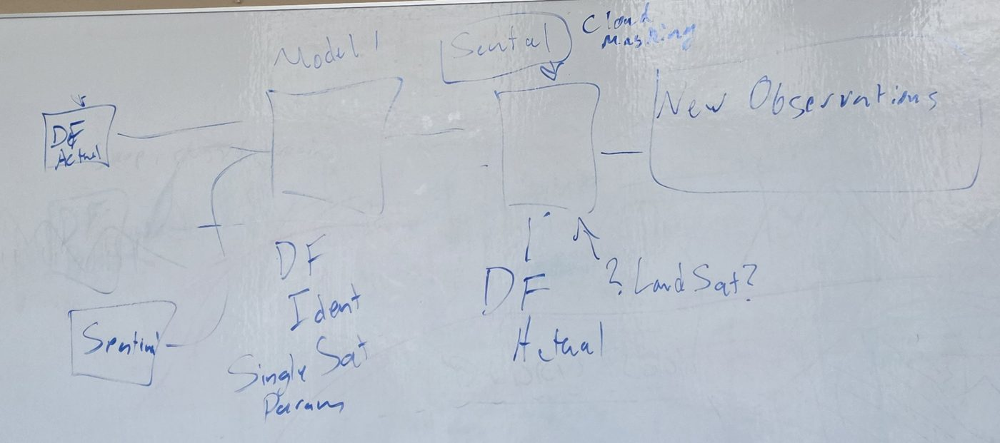
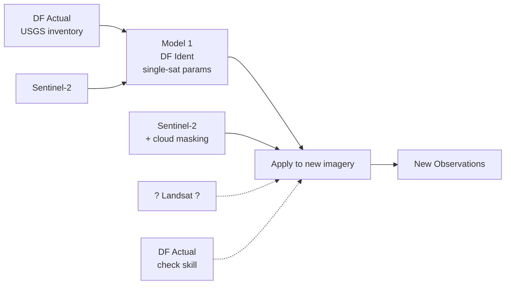
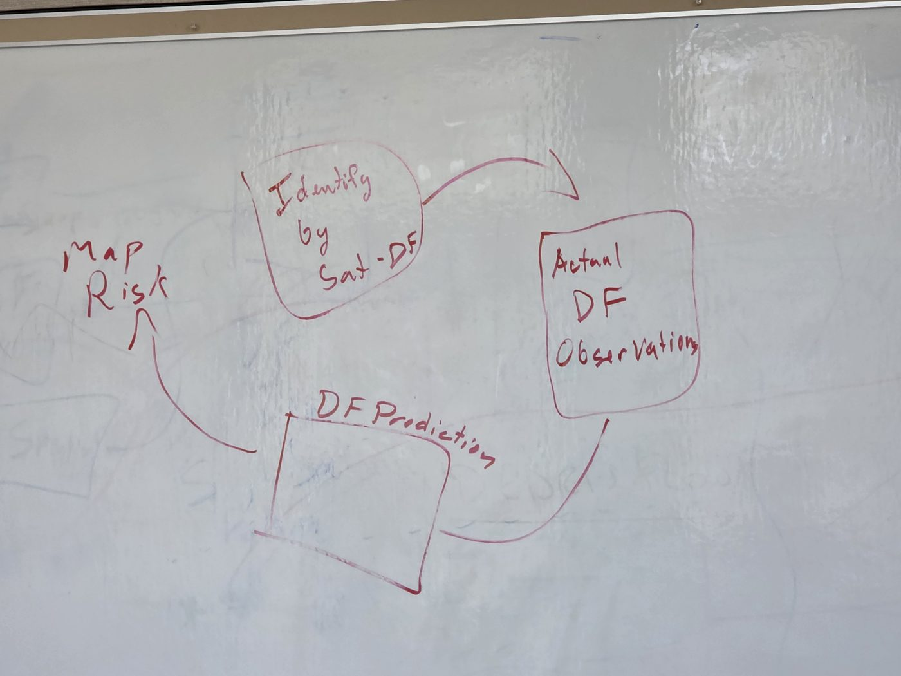
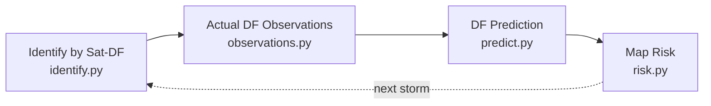
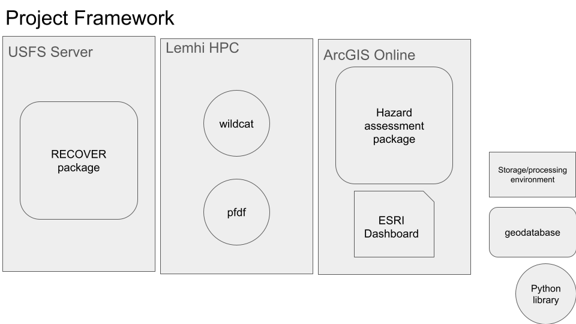

# Architecture -- from the whiteboards to the code

The design comes from two whiteboard sessions (Sept 18-19, 2026) and the
team's Project Framework slide. This page maps every box on those boards to
the module that implements it.

## 1. Model 1 -- identifying debris flows from satellites (blue board)

| Whiteboard box | Code | What it does |
|---|---|---|
| **DF Actual** | `observations.load_inventory` | Loads the USGS Runoff-Generated Postfire Debris-Flow Inventory (8,981 observations, 1,140 debris flows; doi:10.5066/P1R9VXC4) into one schema. |
| **Sentinel** | `sensors.SENTINEL2_L2A`, `ingest.find_scenes` / `load_bands` | Sentinel-2 L2A from Earth Search. Bands are addressed by role (NIR = B08, SWIR2 = B12). |
| **Model 1 -- DF Ident, Single Sat Param** | `identify.compute_feature_stack`, `identify.DebrisFlowIdentifier` | Spectral-change features from *one* sensor's before/after pair (NBR, NDVI, their change across the storm, SWIR brightening, burn dNBR), then a random forest trained on inventory outcomes. `cross_validate` holds out whole fires. |
| **Cloud Masking** | `masking.scl_valid_mask`, `qa_pixel_valid_mask`, `aot_valid_mask`, `qa_aerosol_valid_mask`, `masked_median_composite` | Clouds and shadows from each sensor's QA band, optional smoke test from aerosol data, and a multi-scene composite so a pixel only has to be clear once. |
| **? Landsat ?** | `sensors.LANDSAT_C2_L2`, `identify.fuse_sensors` | Landsat 8/9 C2 L2 (NIR = B5, SWIR2 = B7). One Model 1 per sensor, then fused. Agreement raises confidence; disagreement goes to human review. HLS (harmonized Landsat + Sentinel-2) is an open alternative. |
| **Second box (apply)** | `identify.detect` -> `summarize_by_basin` -> `basin_observations` | Per-pixel probability on channels only, rolled up per basin into a **positive** (debris flow seen) or a **negative** (basin clearly seen, nothing there). Basins too cloudy to judge get no observation. |
| **New Observations** | `observations.merge_new_observations` | Adds them to the inventory, skipping duplicates of the same storm. |

## 2. The feedback loop (red board)

`loop.run_iteration` runs one full turn:

1. **Identify by Sat-DF**: fuses the Sentinel-2 and Landsat basin observations for the storm.
2. **Actual DF Observations**: attaches basin T, F, S and merges into the inventory.
3. **DF Prediction**: recalibrates the USGS M1 likelihood model from *trusted* observations and keeps the update only if it doesn't hurt predictions on held-out fires.
4. **Map Risk**: per-basin likelihood, USGS 20% classes, the rainfall threshold, and hit / miss / false alarm / correct negative wherever there is an observation. Exports GeoJSON.

The state (inventory, coefficients, full history) persists between runs with
`loop.save_state` / `load_state`.

### Why the loop matters for Idaho

The USGS inventory covers AZ, CA, CO, MT, NM, UT, WA and WY: **no Idaho
fires**. Keith noted the rainfall thresholds were trained mostly on California,
and that Idaho soils differ. With `LoopConfig(region="idaho")`, the likelihood
model is recalibrated only from Idaho observations, and satellites are how
those observations get produced at all.

### Guardrails (so the loop doesn't teach itself its own mistakes)

- **Trusted gate** (`observations.trusted`): verified observations always
  count. Unverified satellite observations count only at confidence >= 0.9.
  Everything is still stored, so lower-confidence ones can be reviewed by a
  person.
- **Held-out acceptance** (`loop.run_iteration`): a recalibration is kept only
  if log loss on held-out fires doesn't get worse.
- **Anchored refits**: every recalibration starts from the published Staley
  et al. (2017) coefficients and uses all trusted observations, so no data is
  counted twice across iterations.
- **Per-basin rainfall**: M1 needs rainfall *per basin* (MRMS, from the Debris
  Flow Hunters team's work). With one number per storm, the intercept and the
  rainfall terms can't be separated. This showed up clearly in the synthetic
  demo.

> **Naming:** the whiteboard's "Model 1" is our satellite debris-flow
> *identifier* (`identify.py`). USGS "M1" (Staley et al. 2017) is the
> *likelihood* model in `predict.py`. They are different things.

## 3. Where it sits in the Project Framework

| Framework box | Role in the loop |
|---|---|
| USFS Server -- RECOVER package | Authoritative dNBR, perimeter and soils (`recover.py`). They feed wildcat/pfdf and cross-check our own dNBR. |
| Lemhi HPC -- wildcat, pfdf | Delineate basins/segments and compute T, F, S per basin, the inputs to `predict.py`. The loop itself is light enough to run there too. |
| ArcGIS Online -- hazard assessment package, ESRI Dashboard | Where the Map Risk GeoJSON goes. `app.py` (Streamlit) is the local and demo stand-in. |
| Python library | This package, `afterburn_watch`. |

## 4. What is real vs. not yet

| Piece | Status |
|---|---|
| Band maps, indices, masks, M1 math, recalibration, loop, risk export | Implemented and unit tested (41 tests) |
| Whole loop end-to-end | Runs on **synthetic** data (`scripts/demo_synthetic_loop.py`) |
| Sentinel-2 / Landsat download (`ingest.find_scenes`, `load_bands`) | Written, **not yet run** against the live catalogs |
| USGS inventory loading | Written. **Column mapping to confirm** against the real CSV + README |
| Model 1 on real imagery | **Not trained yet.** Needs inventory sites x real scenes |
| Basin T, F, S | From wildcat/pfdf runs on Lemhi, **not wired in yet** |
| Per-basin storm rainfall | From MRMS (Debris Flow Hunters), **not wired in yet** |
